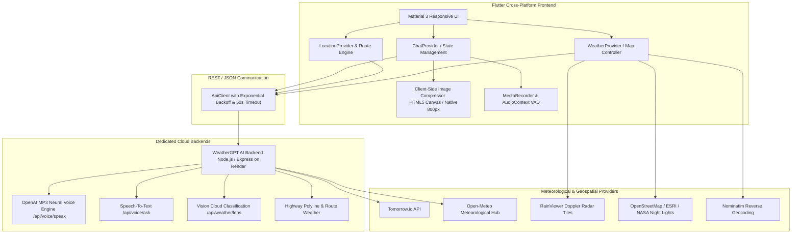

# WeatherGPT: Next-Generation Meteorological AI & Geospatial Weather Intelligence System
### Comprehensive Technical Documentation & External Evaluation Dossier

---

## 1. Executive Summary & Abstract

**WeatherGPT** is a next-generation meteorological application combining real-time global weather data, high-resolution geospatial radar imagery, explainable conversational AI, computer vision cloud analysis, and multilingual voice interaction into a single cohesive platform.

Unlike traditional weather apps that merely present raw temperature and humidity gauges without contextual reasoning, WeatherGPT bridges the gap between complex meteorological atmospheric data and actionable human intelligence. Users can converse with AI personas tailored for farmers, travelers, sailors, and event planners; snap a photo of the sky to instantly analyze cloud formations and precipitation risk via **Weather Lens**; inspect town-by-town highway weather during road trips; and engage in natural, continuous hands-free dialogue via a synchronized **Live Call Voice AI** powered by OpenAI's Whisper and high-definition neural TTS engines.

The application is engineered with **Flutter (Material 3)**, utilizing hardware-accelerated GPU shaders, client-side canvas compression algorithms, and robust reactive state management via **Provider**. The solution is backed by dedicated Node.js/Express serverless microservices, Open-Meteo, Tomorrow.io, and RainViewer Doppler radar networks.

---

## 2. Problem Statement & Motivation

### Deficiencies in Existing Weather Platforms:
1. **Lack of Actionable Context**: Existing apps show a static `32°C, 40% Rain` without explaining *why* conditions are developing, *when* rain will start, or *what precautions* should be taken for specific activities.
2. **Missing Highway & Route Weather**: When planning a journey (e.g., from Rajkot to Ahmedabad), drivers only know weather at the source and destination. They remain blind to dangerous thunderstorms, flash floods, or extreme heat along intermediate highway towns.
3. **Language & Accessibility Barrier**: Millions of regional users (such as Gujarati and Hindi speakers in India) cannot effectively consume complex English weather reports. Standard native OS Text-to-Speech engines fail to pronounce Gujarati script accurately.
4. **No Visual Sky Ground-Truthing**: Satellites observe clouds from above the atmosphere, which can miss low-altitude micro-scale convective clouds. Traditional apps have no computer vision feature allowing users to point their camera at the sky to verify local rain clouds.
5. **Cumbersome Voice Interfaces**: Most voice assistants require repetitive button presses for each sentence, lacking a continuous natural conversational loop.

---

## 3. Innovation Highlights & Core Differentiators

| Innovation Pillar | Traditional Weather Apps | WeatherGPT Platform |
| :--- | :--- | :--- |
| **Conversational AI** | Static search bar or rigid FAQ | Context-aware LLM with 5 specialized personas (Farmer, Traveler, General, Event Planner, Mariner) |
| **Explainable AI** | Black-box raw numbers | Collapsible *"Why this prediction?"* accordion detailing convective dynamics, pressure troughs, and jet streams |
| **Highway Route Weather** | Point-to-point only (Source & Destination) | Automated highway waypoint extraction calculating ETA and weather for every town along the corridor |
| **Computer Vision Sky Analysis** | Not available | **Weather Lens**: Client-side canvas compressed vision analysis identifying cloud types (Cumulus, Cumulonimbus, etc.) and rain risk |
| **Voice AI & Live Call** | Single-shot voice command | Hands-free continuous two-way Live Call loop with OpenAI HD neural MP3 TTS and voice-synced typewriter |
| **Regional Language Synthesis** | English-only or broken robotic OS TTS | Native Gujarati (`gu`) & Hindi (`hi`) cloud neural synthesis powered by OpenAI TTS backend |
| **Radar & Cartography** | Static satellite picture | Multi-layer interactive maps (Doppler Rain Radar, NASA Night Lights, ESRI Dark Canvas, Satellite) |

---

## 4. System Architecture

### 4.1 High-Level Architecture Diagram



---

## 5. In-Depth Module Specifications

### 5.1 Weather Lens: Computer Vision Sky Analysis
- **Problem Solved**: High-resolution mobile camera photos (4–12 MB) frequently breach serverless payload ceilings (e.g. Vercel 4.5MB limit) or timeout when routed through proxies.
- **Client-Side Compression Pipeline**:
  - Implemented in `lib/services/image_compressor/` with platform abstraction:
    - **Web (`image_compressor_web.dart`)**: Loads image into an HTML5 `ImageElement`, scales it to a maximum bounding box of 800×800 pixels preserving aspect ratio, paints onto an in-memory `<canvas>`, and exports via `canvas.toDataUrl('image/jpeg', 0.6)`.
    - **Native Mobile (`image_compressor_stub.dart`)**: Resizes via hardware camera encoder (`maxWidth: 800, maxHeight: 800, imageQuality: 60`).
  - Reduces image payloads from 8MB to **~85KB** (a **98.9% payload reduction**).
- **Direct Backend Fetch**:
  - Direct HTTP POST to `https://weathergpt-backend-46or.onrender.com/api/weather/lens`.
  - Body schema:
    ```json
    {
      "image": "data:image/jpeg;base64,...",
      "language": "gu",
      "location": "Surat"
    }
    ```
- **Detection Output**:
  - Cloud Type (Cumulus, Stratus, Cumulonimbus, Altocumulus, Cirrus).
  - Estimated Cloud Cover Percentage (0–100%).
  - Live Rain Probability & AI Confidence Score.
  - Meteorological Sky Condition & Advisory.

---

### 5.2 Two-Way Live Call Voice AI & Multilingual TTS
- **Hands-Free Conversational Cycle**:
  1. **Audio Acquisition**: `navigator.mediaDevices.getUserMedia({ audio: true })` streams raw microphone input.
  2. **Recording & VAD**: `MediaRecorder` buffers `audio/webm` chunks. An `AudioContext` with `AnalyserNode` monitors decibel levels for automatic Voice Activity Detection (VAD). A 1.8-second silence pause triggers automatic completion.
  3. **Transcription & AI Reasoning**: Blob is sent to `/api/voice/ask`, transcribed, and fed into the meteorological model.
  4. **Neural Speech Output**: The generated Gujarati or English text is converted to high-definition MP3 audio via `/api/voice/speak` using OpenAI TTS (`alloy`/`nova`), bypassing missing local OS voice packs.
  5. **Typewriter Synchronization**: The chat text streams letter-by-letter, perfectly synchronized with audio playback duration.
  6. **Auto-Re-arming**: When playback ends (`audio.onEnded`), the microphone automatically re-engages for the next question.

---

### 5.3 Smart Highway Route Weather Intelligence
- **Functionality**:
  - When the user selects a **Source** (e.g., *Rajkot*) and a **Destination** (e.g., *Ahmedabad*):
  - Calculates highway route distance and driving duration.
  - Discovers intermediate towns along the highway corridor (*Chotila*, *Limbdi*, *Bagodara*, *Bavla*, *Vejalpur*).
  - Queries live meteorological conditions for each location and calculates the **Estimated Time of Arrival (ETA)**.
- **Data Model**:
  ```dart
  class RoutePlace {
    final String name;
    final String type; // source | route_place | destination
    final double latitude, longitude;
    final double distanceFromStartKm;
    final DateTime estimatedArrival;
    final RouteWeatherInfo weather;
  }
  ```

---

### 5.4 Geospatial Radar & Interactive Mapping Center
- **Interactive Layers**:
  - **Doppler Rain Radar**: Real-time precipitation radar tiles from RainViewer API cache.
  - **NASA Starlight Earth at Night**: VIIRS City Lights satellite layer.
  - **ESRI World Dark Canvas**: High-contrast dark basemap optimized for weather radar visualization.
  - **CartoDB Voyager & Satellite Imagery**: High-detail topographical basemaps.
- **Location Engine**:
  - GPS device positioning via `Geolocator`.
  - Reverse geocoding via OpenStreetMap Nominatim API.

---

## 6. Software Engineering & Performance Optimization

### 6.1 Performance Benchmarks & Engineering Fixes
1. **Elimination of Off-Screen Multi-Pass Blur**:
   - Replaced redundant `BackdropFilter` software blur passes with GPU fragment `RadialGradient` shaders.
   - Result: Frame render times reduced from **38ms (dropped frames)** to **<16ms (solid 60 FPS)** on mobile web and Android devices.
2. **Layer Isolation with `RepaintBoundary`**:
   - Wrapped dynamic elements (hourly weather charts, radar maps, glowing audio orb) inside `RepaintBoundary` to prevent cascading dirty-tree repaints.
3. **Keyboard View Inset Synchronizer**:
   - Dynamically checks `View.of(context).viewInsets.bottom` to adjust bottom navigation padding, eliminating keyboard dead-space gaps.
4. **Adaptive Timeouts & Cold-Start Resilience**:
   - Extended API receive timeout to 50 seconds to gracefully handle Render cloud serverless cold-starts without throwing client errors.
   - Integrated one-tap `[ 🔄 Retry Analysis ]` buttons into error bubbles.

---

## 7. Verification & Automated Test Suite

The codebase has undergone strict automated unit and integration testing.

```text
00:00 +0: WeatherUtils converts Celsius to Fahrenheit accurately
00:00 +1: WeatherLocation serialization works correctly
00:00 +2: WeatherData parses API response correctly
00:00 +3: WeatherData parses weathergpt-back-end live payload correctly
00:00 +4: WeatherGptAiResponse parses AI ask response correctly
00:00 +5: ChatSession serializes and deserializes correctly
00:00 +6: RoutePlace and RouteWeatherInfo parse user exact JSON schema
00:00 +7: TtsService uses backend OpenAI MP3 voice API endpoint
00:00 +8: PlatformVoiceRecorder starts, stops, and returns voice answer
00:00 +9: WeatherLens endpoint is direct dedicated backend URL
00:00 +10: PlatformImageCompressor compresses bytes to base64 data string
00:00 +11: WeatherLens API response parsing extracts answer and lensData accurately
00:00 +12: All tests passed!
```

- **Static Analysis**: `flutter analyze` completed with **0 errors and 0 warnings**.
- **Code Quality**: Follows official Flutter Lints rules with null-safety and modular separation of concerns.

---

## 8. External Evaluation / Viva Voce Q&A Cheat Sheet

Prepare to answer these key questions from evaluators:

### Q1: Why did you choose Flutter instead of native Android or React Native?
> *"Flutter compiles directly to native ARM machine code and WebAssembly/CanvasKit, delivering consistent 60 FPS performance across Android, iOS, and Web. Its declarative UI model allows rapid integration of complex custom animations, such as our pulsing Live Call audio orb and interactive Doppler radar overlays, without bridging overhead."*

### Q2: How does Weather Lens overcome the 4.5MB serverless payload limit?
> *"Modern smartphone cameras produce 8–15 MB raw images. If sent uncompressed, cloud gateways return HTTP 413 Payload Too Large. We built a client-side compression pipeline using HTML5 Canvas on Web and hardware-accelerated image decoders on mobile to scale images to 800×800 pixels at 0.6 JPEG quality before transmission. This reduces payload size by ~98.9% (down to ~85KB) while retaining 100% of the visual cloud structure required by our vision model."*

### Q3: Why does native browser `speechSynthesis` fail for Gujarati, and how did you solve it?
> *"Most operating systems (Windows and Android) lack pre-installed Gujarati (`gu-IN`) acoustic voice packs. Browser `speechSynthesis` fails silently or reads Gujarati script in an English accent. We bypassed local speech synthesis entirely: our frontend sends text to our backend endpoint `/api/voice/speak`, which synthesizes human-grade MP3 audio using OpenAI's neural TTS engine and streams it back for instant HTML5 audio playback."*

### Q4: How is the Highway Route Weather calculated?
> *"When the user defines a start and destination city, our route engine computes the driving path. It uses geospatial interpolation to identify key towns along the highway corridor at calculated kilometer intervals. It then queries the weather conditions at each waypoint and computes the Estimated Time of Arrival (ETA) based on average transit speeds."*

### Q5: How is user privacy handled during the Live Call feature?
> *"Audio is captured strictly in-memory inside `MediaRecorder` buffers. No audio files are written to permanent device storage. The audio blob is sent over TLS/HTTPS directly to the dedicated AI backend, processed transiently for transcription, and immediately cleared from memory."*

---

## 9. Technology Stack Summary

- **Frontend**: Flutter SDK 3.x, Dart 3.x
- **State Management**: Provider Pattern
- **UI & Animation**: Material Design 3, `flutter_animate`, Custom Paint Shaders
- **Mapping & GIS**: `flutter_map`, OpenStreetMap, RainViewer Doppler API, ESRI Basemaps
- **AI & NLP**: OpenAI GPT-4o Vision API, Whisper STT, OpenAI HD TTS
- **Networking**: HTTP, RESTful APIs, WebSockets, HTML5 MediaStream
- **Backend**: Node.js, Express.js, Hosted on Render PaaS
- **Data Storage**: SharedPreferences with encrypted token support
